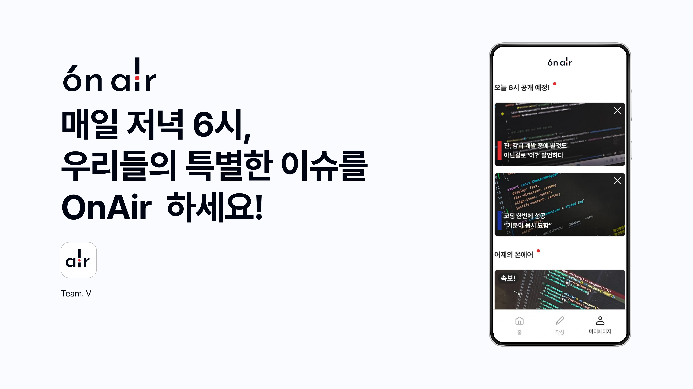

  <h1>OnAir</h1>
  
매일 저녁 6시, 우리들의 특별한 이슈를 OnAir 하세요!

  

 

## 목차

1. [**대회 소개**](#1)
2. [**서비스 소개**](#2)
3. [**주요 기능**](#3)
4. [**시연 영상**](#4)
5. [**팀 소개**](#5)
6. [**개발 기간**](#6)

 

## 🔎 대회 소개

- Plan(PM), Designer, Developer가 한데 모여 진행하는 <strong>[7th UMC Hackathon](https://makeus-challenge.notion.site/7th-UMC-Hackathon-dc693d3d08cf42fbb42b54bba5f36ee7)</strong>

 

## 💻 서비스 소개

- 6시 뉴스처럼 지루하고 권태감 있는 시간을, 익살스럽게 기다려지는 시간으로 만들자.

 

## 💡 주요 기능

### 1) URL만 공유하면, 간편하게 일상을 On Air

- 온에어 생성하기 버튼 클릭 시, 공유용 링크 자동 복사
- 공유된 링크로 들어오는 사용자들은 함께 서비스 이용 가능
- 로그인 없이도 보이는 친구들의 온에어 뉴스

 

### 2) 부담없이 작성하는 나만의 뉴스

- 모두 주목! 가장 상단에 띄우는 나만의 뉴4
- 반반의 6시, Good news 와 Bad news로 분위기 체9
- 1,000자 이내의 간단한 뉴스 공유로 부담없이 사용

 

### 3) 우리의 일상, 유쾌하게 확인하기

- 나쁜 소식도 하나의 속보일 뿐!
- 컬러로 긍정, 부정 뉴스 인
- 가짜뉴스 놉! 솔직하고 담백한 우리만의 뉴스

 

### 4) 쓰는 건 그 순간, 공개는 6시! 설렘을 간직하세요.

- 24시간 언제든지 나만의 뉴스 작성 가능
- 모든 사용자의 뉴스를 모아 저녁 6시 공개
- 마이페이지에서 공개 예정인 나의 뉴스 확인 및 삭제 가능

 

## 🕹️ 시연 영상

|                                           온보딩 및 홈 페이지                                            |                                                뉴스 등록 페이지                                                |                                                뉴스 보기 페이지                                                |
| :------------------------------------------------------------------------------------------------------: | :------------------------------------------------------------------------------------------------------------: | :------------------------------------------------------------------------------------------------------------: |
|  |  |  |

 

## 💪 팀 소개

|     PM      | Designer  |
| :---------: | :-------: |
| 위니/이주영 | 진/최수진 |

|                  Front-end                   |                 Front-end                 |                Front-end                 |
| :------------------------------------------: | :---------------------------------------: | :--------------------------------------: |
| [윈터/류미성](https://github.com/misung-dev) | [제이/박유진](https://github.com/pkyujin) | [주니/이준희](https://github.com/jjjuni) |

|                    Back-end                    | Back-end                                  |                  Back-end                   |
| :--------------------------------------------: | ----------------------------------------- | :-----------------------------------------: |
| [도도/강도경](https://github.com/dokyung-kang) | [비쿠/주현준](https://github.com/bikooju) | [채이/이채은](https://github.com/chaechaen) |

 

## 📅 대회 기간

2025년 1월 11일 ~ 2025년 1월 12일 (무박 2일)

 
